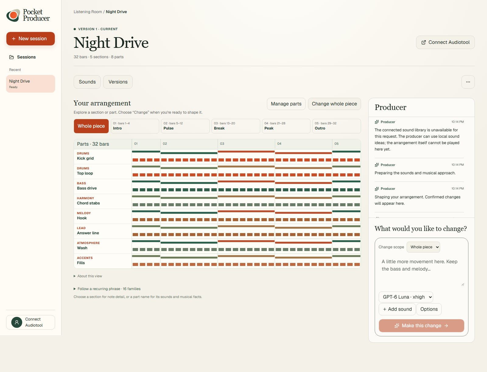
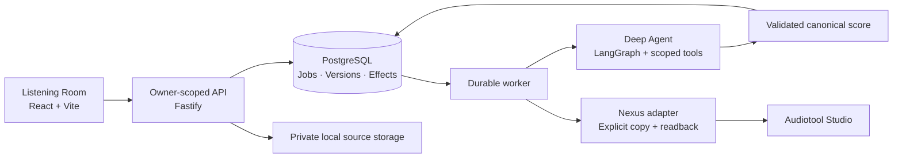

<div align="center">
  
  <h1>Pocket Producer</h1>
  <p><strong>Your idea. An arrangement you can keep shaping.</strong></p>
  <p>A conversational music producer that builds editable Audiotool arrangements,<br />with a living score, precise revisions and a calm place to create.</p>
  <p><a href="#try-it-locally">Try it locally</a> · <a href="#the-creative-loop">The creative loop</a> · <a href="#how-it-works">Architecture</a> · <a href="docs/PROJECT-WALKTHROUGH.md">Project walkthrough</a></p>
</div>



*Actual application, running with isolated deterministic test data. This screenshot demonstrates the interface—not live-model musical quality or rendered audio.*

## From a feeling to something you can shape

Start with a mood, a detailed production brief, or an unfinished idea. Pocket Producer turns that direction into musical structure: sections, parts, notes, motifs, instruments, effects and automation. Follow the construction, inspect what changed, and keep the parts you love while asking for something new.

The result is **editable music**, not just a flattened audio file. When you're ready, explicitly copy a saved arrangement to Audiotool and continue working in Studio.

> **Current boundary:** this is a local development preview. Native full-mix rendering and playback inside Pocket Producer are not implemented. You can audition source samples; those are not a playback of the arrangement. It is not ready to be exposed as a public multi-user service.

## The creative loop

1. **Describe your idea.** Write a few words or a full brief. *Inspire me* and *Rewrite prompt* help you find a direction; recordings are optional.
2. **Watch it take shape.** The Producer plans, constructs, inspects and refines through validated musical tools. The arrangement reflects confirmed changes, not simulated activity.
3. **Explore the music.** Move between the whole piece, sections and parts. Inspect notes, recurring phrases, clips, sound settings and automation.
4. **Give precise direction.** “Thin the drums in the build, but keep the melody and bass.” Choose a scope and protect material you want unchanged.
5. **Compare and choose.** Inspect Before / After / Changes. Successful revisions become current automatically; comparison is read-only, and choosing another saved version is explicit.
6. **Continue in Audiotool.** Connect your account and choose **Copy to Audiotool**. The app checks the copied structure before offering the verified project link. Copying is never automatic.

### What makes it different

| | |
| --- | --- |
| **A living arrangement** | A responsive Listening Room with a section-and-part overview, musical inspection and motion tied to confirmed construction. |
| **Creative control that stays editable** | Validated notes, motifs, instrument parameters, effects, routing, sources and automation—not an opaque generation blob. |
| **Protected revisions** | Named material and section scope are checked against canonical data. Saved versions are immutable. |
| **Work that survives interruption** | Durable plans, step replay, checkpoints, worker leases, cancellation and guarded continuation. |
| **Bounded model use** | Captured per-job limits plus shared, provider and owner allowances. Unknown outcomes keep their financial holds. |
| **An explicit Studio handoff** | Nexus mapping, readback and recoverable synchronization without pretending a saved score is heard audio. |

## Try it locally

### Prerequisites

- **Node.js 22.14+ within the 22.x line, or Node.js 24.x** (the project requires Node `<25`).
- **pnpm 11.19.0**. If `pnpm` is not recognized, install it with `npm install --global pnpm@11.19.0`, then open a new terminal. Alternatively, prefix the commands below with `corepack` (`corepack pnpm install …`).
- **Docker with Compose**, running, for PostgreSQL 17.

### Start with the no-cost demo

This repository is private; cloning requires access through your GitHub account.

```sh
git clone https://github.com/theBlackfish01/PocketProducer.git
cd PocketProducer
pnpm install --frozen-lockfile
```

Create the local configuration **without overwriting an existing `.env`**:

```powershell
# PowerShell
if (!(Test-Path .env)) { Copy-Item .env.example .env }
```

<details>
<summary>macOS / Linux shell</summary>

```sh
test -f .env || cp .env.example .env
```

</details>

The example configuration starts in **fixture mode with zero spending caps**. No API key or Audiotool account is needed for the local demonstration.

```sh
pnpm db:up
pnpm db:migrate
pnpm generate:fixtures
pnpm seed:demo
pnpm dev
```

Open **http://127.0.0.1:5173**. Choose **New session**, describe an idea and select **Create arrangement**. Try a section-scoped change, protect a part, then compare versions. Fixture mode exercises the workflow using deterministic music; it is not a real-model evaluation.

The API listens on `127.0.0.1:8787`; PostgreSQL is mapped to `127.0.0.1:54329`. `pnpm dev` starts the web app, API and worker together. `Ctrl+C` stops those processes; `pnpm db:down` stops PostgreSQL without deleting its named volume.

### Use a real producer

Add credentials only to the ignored root `.env`, set `FIXTURE_MODE=false`, and deliberately configure the combined, provider, owner and per-job allowances. The zero defaults intentionally prevent paid requests. Restart the API and worker after changing environment configuration.

| Producer | Credential | Behavior |
| --- | --- | --- |
| GPT-6 Sol | `OPENAI_API_KEY` | Default producer through the OpenAI Responses API. |
| GPT-6 Luna · xhigh | `OPENAI_API_KEY` | Same tool workflow, with captured xhigh producer reasoning. |
| Gemini 3.7 Flash | `GEMINI_API_KEY` | Gemini producer through the existing compatible tool adapter. |

Rewrite/Inspire uses a separate Luna helper. Symbolic review is not listening. Provider availability in the chooser means a credential is configured—not that the account has credit or that a generation has been verified.

Read [model selection and shared usage](docs/model-selection.md) before enabling paid work. A different model or a new session does not reset accumulated usage.

### Connect Audiotool

Register your own Audiotool application and set `AUDIOTOOL_CLIENT_ID`. Use this exact local callback:

```text
http://127.0.0.1:5173/auth/audiotool/callback
```

Open Pocket Producer in the browser you normally use for Audiotool, choose **Connect Audiotool**, and complete consent. A saved arrangement can then be copied explicitly. See [Audiotool setup](docs/USER-SETUP.md#audiotool-application-registration) and [Nexus integration](docs/nexus-integration.md) for scopes, expiry and recovery.

OAuth tokens are encrypted locally. Do not paste them into source files or the browser console. A stale or uncertain copy must be reconciled, not retried under a new identity.

## How it works



The model proposes operations; domain validation, ownership, protections and financial guards decide what can happen. PostgreSQL holds canonical music, immutable revisions, job progress and effect receipts. An outbox and lease/fencing queue coordinate the worker. Provider requests and remote mutations are tracked independently so a retry cannot silently repeat an uncertain effect.

| Area | Implementation |
| --- | --- |
| Interface | React, Vite, TypeScript, Tailwind, owned shadcn/Base UI components, Lucide, Motion + SVG |
| Producer | Deep Agents / LangGraph, scoped runtime skills, retained creative context and validated musical tools |
| Backend | Fastify, PostgreSQL, durable job/effect ledgers, private content-addressed assets |
| Music | Native v2 canonical document, 960 PPQ, sections, motifs, notes, clips, routing and automation |
| Audiotool | Pinned Nexus SDK, encrypted OAuth sessions, native mapping/readback and guarded copy recovery |
| Verification | Vitest, PostgreSQL integration tests, scripted model transports and Playwright browser journeys |

Explore the [architecture](docs/architecture.md), [native construction contract](docs/native-text-to-music.md), or the [interactive architecture course](docs/pocket-producer-course/index.html). Download/clone the repository to open the course locally; it is a self-contained static page, not a hosted demo.

## Test and verify

```sh
pnpm lint
pnpm typecheck
pnpm test
pnpm test:integration
pnpm exec playwright install chromium
pnpm test:e2e
pnpm test:visual
pnpm test:course:static
pnpm build
```

On Linux, use `pnpm exec playwright install --with-deps chromium` when system browser libraries are missing. Run database integration and end-to-end suites **serially**: they share an isolated `_test` database. Normal tests disable provider credentials and tracing; no paid generation or Audiotool write is part of CI.

Coverage includes protected revisions, immutable history, ownership, duplicate requests, worker restart/contention, cancellation, unknown provider outcomes, quota recovery, tool errors, source handling, desktop/phone layouts and reduced motion. [STATUS](docs/STATUS.md) records actual commands and results; [testing notes](docs/testing.md) distinguish scripted evidence from live-provider evidence.

## Repository guide

```text
apps/web/          Listening Room and source audition
apps/api/          HTTP API, ownership and streaming activity
apps/worker/       Durable construction and copy execution
packages/core/     Canonical music, agent, providers, Nexus and database
agent-skills/      Scoped musical guidance available to the producer
tests/             Unit, integration, browser and visual checks
scripts/           Setup, verification and operator diagnostics
docs/              Architecture, design, evidence and project walkthrough
```

## Status, privacy and boundaries

- **Private development preview.** Loopback authentication uses one development identity. Per-owner accounting is tested, but public multi-user authentication and deployment are not shipped.
- **No native full-mix playback yet.** Construction validity, symbolic critique, remote structural fidelity and heard musical quality are separate kinds of evidence.
- **Selective live evidence.** Some prior model and Audiotool-copy runs are documented; they do not certify every model, instrument, source or generated arrangement. Luna xhigh has offline request/workflow coverage, not a completed live quality evaluation.
- **Private by default.** `.env`, local audio, OAuth encryption keys, raw traces and database data stay out of Git. LangSmith is optional; trace input/output hiding defaults to enabled. See [security guidance](SECURITY.md).
- **No public deployment or submission is performed by these scripts.** A demo video and public-release checklist are separate delivery steps.

This private snapshot does not grant a project-wide open-source license. Dependency and asset provenance are recorded in [third-party notices](THIRD_PARTY_NOTICES.md). Choose an appropriate project license before any public release.

---

<div align="center"><em>A little more intention. A little more room to make it yours.</em></div>
