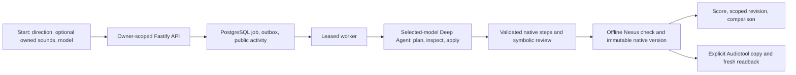

# Pocket Producer: current project walkthrough

Checked against the local checkout on 2026-09-27, including the separately tested Luna producer-selection work recorded in status. This is a component-by-component explanation, not an assertion that every provider route, musical result or Audiotool feature has been verified live. [Live status](STATUS.md), the [native construction contract](native-text-to-music.md), [model-selection contract](model-selection.md), and [single-workspace decision](adr/003-single-composition-workspace.md) take precedence as the project evolves. The focused review found three defects; a later commit fixed and tested R1/R2, while the reconciliation CLI's stale v7 label (R3) remained. See [the focused review](reviews/2026-09-27-commit-review.md).

## 1. The product now: one composition workspace

Pocket Producer is a local, responsive Listening Room for building an **editable native musical arrangement** from a text direction and optional owned recordings. The user starts a session, chooses a producer and a bounded profile, follows durable construction, inspects a symbolic score, asks for a scoped revision while keeping chosen material, compares immutable versions and can explicitly copy a particular version to Audiotool.

There is **no separate Playable audio product** anymore. The old four-stem planner, local whole-piece renderer/player, audio A/B history, stem exporter and compatibility routes were retired by [ADR 003](adr/003-single-composition-workspace.md). Historical database tables and minimal audit identities remain so prior spending is not erased; they are not an editor or migration source. Sounds still lets a person record, upload and audition an original WAV. That audition is **not playback of the constructed piece**.

The accepted native artifact is a versioned score: sections, parts, notes, motifs, clips, parameters, routing and automation. Native rendering/playback and full-mix Gemini listening are deliberately deferred. The score's density and animated changes describe saved structure, not loudness or heard quality. An Audiotool copy can make mapped notes and controls editable, but an audio clip remains a clip and its internal notes do not become MIDI.

The strongest retained live example is *Midnight Escalator*: a GPT-6 Sol website job accepted a 40-bar, five-section, five-part score with 777 note starts. An explicit Audiotool copy of that immutable version later matched fresh authenticated structural readback under mapper v7. The user's listening judgment and the offline sound-craft review identified musical weakness despite those structural successes. A second named work-in-progress example, *Lantern*, is paused with confirmed steps and no accepted version; it must not be described as a finished piece. Neither example proves the general system routinely makes compelling music or renders native audio. [Live Sol evidence](sol-browser-run-2026-09-27.md), [Audiotool evidence](STATUS.md#midnight-escalator-audiotool-copy-verified-2026-09-27), and [sound-craft diagnosis](sound-craft-pass-2026-09-27.md) distinguish those claims.

## 2. What the user sees from Start to Producer

**New session** opens a focused idea-entry screen. The direction can be brief or detailed (3–32,768 characters); an owned WAV is optional. Sounds is secondary. The current labelled producer picker offers GPT-6 Sol, GPT-6 Luna with xhigh reasoning, or Gemini 3.7 Flash; Creation options holds Standard/Extended. Historical Gateway DeepSeek jobs and accounting remain readable, but that route is no longer offered for a new public request. Credential-configured availability does not prove credit or a successful live response. The chosen model, reasoning and price evidence are captured with a create/revise request; a running or continued job does not silently switch model or wallet. [Direction composer](../apps/web/src/features/native/direction-composer.tsx), [model catalogue](../packages/core/src/providers/models.ts).

**Rewrite** and **Inspire me** are separate, small GPT-6 Luna prompt-assistance requests. They return editable suggestions, not a constructed score, and do not submit the producer job. The user can undo a suggestion; late responses are ignored after typing, navigation, source or scope changes. The owner-scoped API validates expected head and sources, uses an idempotent helper identity and accounts for the effect. Its lexical preservation check helps retain explicit constraints but is not a semantic guarantee. [Prompt assistance](../packages/core/src/providers/prompt-assistance.ts), [API route](../apps/api/src/server.ts), [contract](architecture.md#prompt-assistance-boundary-2026-09-27).

After the server durably accepts **Create arrangement**, the app moves to `/sessions/:id`; `/sessions/:id/start` is the idea-entry state. Desktop gives the saved score and Producer useful side-by-side space; narrower layouts use an in-page Arrangement/Producer switch. The Producer feed contains the submitted direction, saved approach, confirmed changes, lifecycle decisions and version references. It is not model chain-of-thought, raw tool traffic, token-by-token fabricated speech or LangSmith telemetry. While work runs, the user can draft a *next* direction, but it is not sent or queued automatically. The score remains the central evidence surface. [Native room](../apps/web/src/features/native/native-room.tsx), [Producer feed](../apps/web/src/features/native/producer-feed.tsx), [implemented workspace plan](producer-workspace-plan.md).

## 3. Repository, processes and storage

This is a pinned TypeScript/pnpm modular monolith, not a fleet of independent services. `pnpm dev` starts Vite, the loopback Fastify API and one worker; Docker Compose supplies PostgreSQL. There is no Redis, managed object store or public deployment in this milestone. [Package scripts](../package.json), [Docker Compose](../docker-compose.yml).

| Piece | What it owns | Start reading |
| --- | --- | --- |
| Web app | Start/Producer journey, score, inspector, source recording/audition, scope, comparison, model choice and recoverable UI state | [App](../apps/web/src/App.tsx), [native room](../apps/web/src/features/native/native-room.tsx) |
| Fastify API | Validated owner-scoped commands/reads, upload and audition, model catalogue, activity/SSE, OAuth handoff | [server](../apps/api/src/server.ts), [activity stream](../apps/api/src/activity-stream.ts) |
| Worker | Claims leases, runs native construction and explicit sync, checkpoints effects, commits versions | [worker](../apps/worker/src/worker.ts) |
| Shared core | Native schema/operations, agent, reviewer, resource handling, provider limits/effects, Nexus mapping | [core exports](../packages/core/src/index.ts) |
| PostgreSQL | Projects, owned assets, outbox/jobs/events, plans/steps/reviews, versions/heads, activity, provider ledger and remote checkpoints | [migrations](../packages/core/src/db/migrations/) |
| Private local storage | Validated owned WAV bytes below a server-owned directory | [local storage](../packages/core/src/storage/local-storage.ts) |

The committed migrations run through `024_native_review_recovery_capacity.sql`. Migration 015–016 supports commit-ordered public activity; 017–021 supports creative review, source-opinion caching and listening notes; 022 adds idempotent prompt assistance; 023 adds owner lifetime caps; 024 permits the separately bounded seventh Extended format-recovery attachment. Migration 024 was applied to isolated test and local development databases during the repair pass. No old audio rows are converted into native music.

## 4. API, queue and public activity

The browser sends a native create/revise command with an idempotency key and expected selected head. The API validates direction, model/profile, selected source IDs, scope, ownership and current head, then creates a job and outbox row transactionally. Same key plus same request returns the original job; same key plus different input conflicts. A project-scoped browser receipt can recover a lost acknowledgement without dispatching another paid creative request. [API](../apps/api/src/server.ts), [repository](../packages/core/src/db/repository.ts).

Workers contend through PostgreSQL `SKIP LOCKED`, a database-time lease generation and attempt UUID. Heartbeats check cancellation, deadline, lease ownership and monitor health. A dead attempt can be replaced after lease expiry; the old attempt can settle observed usage but cannot publish progress or commit. Queue wait counts toward the deadline. Before accepting a version, the worker rechecks owner/project, expected head, source hash, lease, cancellation and deadline. Retry, Stop and safe abandonment are separate decisions.

Public activity is an **append-only owner/project-scoped projection** written in the same transaction as the underlying request, plan, step, version or selection fact. An origin deduplicates replay; a locked project clock allocates cursors in commit order. The payload is a presentation allowlist, not authority to apply notes or spend money. The API returns a consistent activity snapshot and provides an owner-checked SSE stream; the browser runs one consumer: snapshot → SSE, or cursor polling after interruption, not both indefinitely. It deduplicates events, can request older pages, resets an invalid cursor after restored data and refetches a canonical draft only when its step/hash changes. Raw model reasoning and private traces never enter this feed. [Activity writer](../packages/core/src/native/activity.ts), [stream](../apps/api/src/activity-stream.ts), [consumer](../apps/web/src/features/native/use-producer-activity.ts).

That division is useful when debugging: if a direction was accepted but the page has no update, inspect receipt/job/activity delivery before blaming the model; if an activity row says a batch was confirmed, inspect the canonical step/hash before treating the narration as music.

## 5. Native v2: the canonical musical document

[The schema](../packages/core/src/native/model.ts) fixes `schemaVersion: 2` and 960 ticks per quarter note. It stores title, exact original direction, current objective, assumptions, tempo, meter, 4–128 bars, up to 24 contiguous sections and 24 parts, motifs, selected sources, protections and an audio state explicitly marked deferred/unavailable/stale. Parts may carry exact MIDI notes, motif placements, owned/library clip intervals, instrument settings, channel gain/pan, effects, parallel chains, automation, group routing and sends. A motif variation retains family and parent identity so one placement can change without rewriting every repeat.

The new-document `mixSemantics: channel-gain-v1` applies part gain once at the mixer channel, while an explicit device gain remains patch-specific. Historical documents without the flag retain their previous mapped interpretation. The Heisenberg main sustain control now maps to `envelopeMain.sustainFactor`. New Gakki parts require a pinned usable preset; a bare device name is not a drum kit. Beatbox8 is deliberately boolean/on-off on specified sixteenth-grid lanes, not velocity-sensitive drums. These are structural/SDK semantics, not promises about how a mix sounds. [Model](../packages/core/src/native/model.ts), [v8 adapter](../packages/core/src/native/adapter.ts), [sound-craft findings](sound-craft-pass-2026-09-27.md).

Every proposed operation is checked for IDs, section coverage, note bounds, source ownership/hash, legal parameters, routing and protected dependencies. `native_revision` holds immutable accepted documents; `native_project_head` points to the selected one. A successful revision normally appends and selects a new version. Reading comparison does not select; **Use Before/After** does. A partial draft or completed plan does not replace the head. Source clips are references to audio regions, not proof they were heard or licensed.

## 6. A selected-model Deep Agent, not three separate composers

The production path is [produceNative](../packages/core/src/native/producer.ts), using Deep Agents on LangGraph and the same validated domain tools regardless of chosen producer. New jobs default to GPT-6 Sol; GPT-6 Luna uses the OpenAI Responses route with captured xhigh producer reasoning, and Gemini 3.7 Flash uses a narrow text/tool compatibility adapter. Historical Gateway DeepSeek jobs retain their captured model, prices and adapter for continuation/accounting, not new public selection. The producer and focused symbolic critic use the captured route, with the small review/helper calls remaining separately bounded. Gemini's audio-analysis adapter is not the same thing as choosing Gemini as producer. Missing provider credentials reject live work; fixture mode is explicit. Provider protocol reasoning/tool signatures remain in private checkpoints, not public activity. [Model routes](../packages/core/src/providers/models.ts), [compatibility adapter](../packages/core/src/providers/compatible-model.ts), [model contract](model-selection.md).

The agent first records a typed, durable plan—form, section purpose, sound goals, hard constraints and development tasks—in `native_job_plan`. It can choose an initial form, apply small musical batches, inspect current sections and refine. The old 32/64-bar blueprint is a fixture, not a production generator. Its virtual workspace and three local runtime skills are read-scoped: [arrangement](../agent-skills/native-arrangement/SKILL.md), [revision](../agent-skills/native-revision/SKILL.md), [sound design](../agent-skills/native-sound-design/SKILL.md). It cannot run a shell, write arbitrary files, remove user protections, render a piece or directly mutate Audiotool.

Long directions stay exact and can be paged through `read_native_brief`. Context compaction retains current canonical score, plan, original brief, recent complete tool-call/reply pairs, latest error and provider-specific opaque context. Bounded successful local guidance reads can survive compaction and continuation; mutable score reads must be refreshed after changes. Optional guidance is evicted first if conservative input pressure grows. The durable plan/steps and PostgreSQL effect ledger—not the graph's chat memory—allow a fresh attempt to resume the same logical job.

| Tool family | Representative tools | Limit of authority |
| --- | --- | --- |
| Plan and read brief | `record_native_plan`, `advance_native_stage`, `read_native_plan`, `read_native_brief` | Intention/stage never selects a version. |
| Inspect saved facts | `inspect_native_workspace`, `inspect_native_section`, `inspect_native_part`, `inspect_native_motif`, `inspect_owned_source` | Measurements and current symbolic facts, not hearing. |
| Discover guidance/resources | `discover_native_capabilities`, `inspect_native_capability`, `search_native_resources`, recipe/example inspection, connected sample/preset/GM search | SDK metadata and local guidance are not write permission or licensing evidence. |
| Construct | Optional initial `compose_native_form`, general `apply_native_batch` | Zod operations, scope, protection, replay and SDK checks remain authoritative; model cannot invoke `protect` through the batch. |
| Shortlisted sound character | Bounded sample-analysis request | Separate Gemini adapter/effect, only selected short source bytes; no native full-mix critique. |

Sound craft now includes seven original, versioned, hashed patch/Beatbox8 recipes and three executable musical studies (groove/response, build/arrival and cross-instrument handoff). They are selectively inspectable guidance, not licensed presets, fixed genre outputs or heard recordings. The agent can retain resource hashes and a project-specific human sample-fit note. A bare Gakki kit or a recipe name by itself does not prove timbre. [Resources](../packages/core/src/native/resources.ts), [examples](../packages/core/src/native/examples.ts), [sound feedback](../packages/core/src/native/sound-feedback.ts).

## 7. Independent completion and symbolic critique

The [intent interpreter](../packages/core/src/native/intent.ts) conservatively extracts explicit tempo, meter, total/section lengths, entrances, role requirements or exclusions, chord chains, named preservation, scoped changes and requested processing. “Keep bass” differs from “no bass”; “bring in chords” is not a section title. Ambiguous theme families need a more precise name or explicit lock. The [completion gate](../packages/core/src/native/producer.ts) tests objective obligations on the actual document, including whether a requested revision changed the target and preserved named material. A schema-valid but ineffective proposal can be returned for correction.

The producer must inspect at least two current sections after its last mutation and obtain a valid, separately accounted **symbolic editor review** tied to the final document and substantive plan/direction hashes. The reviewer sees note events, velocities, motifs, controls, patch settings, routing, preset/kit identity and a coarse middle/arrival arc; prior findings remain visible. It can return at most four ID-grounded findings per response. Invalid, truncated, exhausted or unavailable review cannot silently become a clean model endorsement. One separately charged format-recovery call can address an unusable response under the same job/call/site guards; a settled repair can be attached after interruption without repeating the provider call. [Review model](../packages/core/src/native/review-model.ts), [critique schema](../packages/core/src/native/critique.ts), [recovery contract](native-finishing-recovery.md).

Finishing guidance starts around 30 producer turns and focuses on remaining requirements around 45. Fifty is a target, not a forced acceptance or hard stop. Repeated identical musical/plan/checklist state without useful new evidence warns at six turns and safely pauses at twelve; novelty from varied inspection pages is bounded. Standard allows four ordinary review attempts and Extended six, within all financial limits. The Extended seventh attachment is reserved for one settled format-recovery effect, not a new ordinary review. Migration 024 and targeted interruption tests repaired the previously reproduced database conflict. See [repair evidence](STATUS.md) and [original review](reviews/2026-09-27-commit-review.md).

This gate proves neither memorable melody nor the mix a human will hear. The baseline passed a coarse symbolic arc even though the user judged its playback simple. No full native-mix audio analysis is available to close that gap.

## 8. Replay, partial drafts and safe recovery

[NativeToolSession](../packages/core/src/native/producer.ts) serializes even concurrent model tool mutations. Each confirmed step records a stable key, operation hash, predecessor document hash and result hash. Restart replays in ordinal order and verifies each link; a changed duplicate or corrupted history fails closed. A confirmed draft can be shown as **Work in progress** but remains unselected. `native_producer_completion` records checked aggregate completion separately from plan and steps. The worker validates the final document in pinned Nexus before committing an immutable revision under owner/head/lease/deadline/source/cancellation checks.

A known pre-dispatch call, graph, time, input, output or financial stop may preserve a partial draft or even a zero-musical-step plan on the **same** job. Explicit extension/continuation can retain original effect and step identities; it never raises the installation cap, clears unknown liabilities, changes selected head or copies music automatically. **Leave this draft** explicitly abandons safely paused work while retaining versions, steps and spending. Unknown external effects still require reconciliation. The room distinguishes observed, held and unknown cost instead of suggesting an uncertain call was free.

The committed-tree review reproduced a UX/accounting mismatch: Continue was offered when an owner or selected-provider pool was exhausted, although reservation correctly refused dispatch. The subsequent R2 repair shares the allowance check with submission; tests cover all three provider pools and owner exhaustion. It remains advisory under concurrency and cannot promise that a larger next call fits. The operator reconciliation CLI's v7 label (R3) was still stale while mapper v8 is current. None of these findings authorizes rewriting accepted music or retrying uncertain paid effects. [Repair status](STATUS.md), [original review](reviews/2026-09-27-commit-review.md), [repository](../packages/core/src/native/repository.ts), [limits](../packages/core/src/providers/limits.ts).

*Lantern* illustrates the distinction: a retained plan and six confirmed batches are valuable, but the job is paused, its final usable review is absent and there is no accepted copy-ready version. Offline recovery tests do not authorize or guarantee a paid continuation.

## 9. Sources, Gemini and listening notes

Owned WAV uploads are decoded/validated, hashed, stored privately and attached to an owner/project. Sounds can record/upload, select and audition the original using an owner-checked byte-range route and one coordinated source player. Closing the sheet stops playback and pending capture. The worker rechecks selected bytes and measures duration, peak/RMS and activity windows; these measured facts are not a musical opinion. Supported PCM16/24/Float32 decoding and exact source-region placement are tested locally. [Sources UI](../apps/web/src/features/sources/sources-panel.tsx), [player](../apps/web/src/features/sources/source-player.tsx), [profiling](../packages/core/src/native/resources.ts).

Connected Audiotool samples and presets are a separate category. Search/filter metadata can be briefly cached within one authenticated SDK client; exact identities, preset configuration fingerprints, hash and source interval are checked again before construction/sync. Visibility is not a license. Sounds can play one freshly authorized, inspected original library sample and save an owner/project/sample-hash-scoped “fits” or “not for this piece” note **after playback**. That human note is subjective context for the producer, not a measured property or native composition audition. A selected clip or local mapping alone is not proof of remote upload/readback.

The independent [Gemini adapter](../packages/core/src/providers/gemini.ts) can give typed character observations for shortlisted short source audio, separate from measured signal facts. The captured native profile permits at most two Standard or three Extended distinct paid shortlist checks (older jobs default to two). Subsecond hits are copied unchanged at one-second spacing into separately hashed derivative bytes for analysis; the original measurement and bytes retain their own identity. Successful opinions are cached across jobs only for the same owner, submitted byte hash, prompt version and model, with a cross-worker lock. Unknown/dispatched effects fence repeat work. This is **not** native whole-piece listening, render–critique–repair or a source-rights grant. Historical live Gemini outcomes and billability remain mixed/uncertain in the ledger; the maintained evidence does not establish a successful general listening critique. [Analysis cache](../packages/core/src/native/analysis-cache.ts), [sound-craft contract](sound-craft-pass-2026-09-27.md).

## 10. Listening Room score, inspection and comparison

The web app uses React/Vite, Tailwind, locally owned shadcn-style Base UI components, Lucide and Motion for React in the selected warm ivory/forest/burnt-orange editorial design. The score projection is derived from canonical note events, motif lineage, source clips and supported control curves. The overview's height means **note starts per bar**, not loudness. Focused section detail and a responsive part inspector show exact symbolic positions/pitches, clip intervals, routing and controls; large arrangements use bounded overview blocks, bar paging and progressive part disclosure. [Score projection](../apps/web/src/features/native/score.ts), [score UI](../apps/web/src/features/native/native-score.tsx), [design system](design-system.md).

Inspection does not silently scope a revision. Explicit Change controls target a section, part or whole piece; Keep unchanged identifies protected material. The server's preservation preview checks names and the expected head, while the worker enforces the final protected hashes. A completed revision normally becomes current and opens **Before / After / Changes**. Those views pair time, pitch scale and part order, detect note pitch/timing and known clip/control/routing differences, and call unsupported alignment/easing unverified. Browsing is read-only; **Use Before/After** explicitly changes local selection. Local restore never silently updates an Audiotool copy.

The current layout keeps an aligned start composer and compact workspace, expandable long public messages, practical pause reasons, source/model controls and a prominent state-aware Audiotool action. Sounds, Versions and Session options are secondary panels. Prompt help stays editable with Undo. Confirmed note/clip/control changes can animate from saved before/after facts; duplicate/late/reloaded receipts do not replay invented construction steps, and reduced motion shows the same final facts. Desktop and emulated phone Chromium checks exist, but physical keyboard/safe areas, screen-reader study and Firefox/WebKit are still separate verification work. [Native room](../apps/web/src/features/native/native-room.tsx), [direction composer](../apps/web/src/features/native/direction-composer.tsx), [testing](testing.md).

## 11. Nexus and Audiotool: an explicit remote boundary

The current [native mapper](../packages/core/src/native/adapter.ts) is `nexus-native-v8` against pinned `@audiotool/nexus@0.0.17`. It converts 960 canonical ticks per beat to the SDK's 3840 scale and writes supported tempo/meter/duration, notes/patterns, instruments, audio regions, effects, group/parallel paths, sends and automation. Offline validation performs semantic readback, not mere entity counts. The mapper refuses automatic overwrite of a nonempty target.

**Copy to Audiotool** is a separate user-triggered job for one immutable version. It preflights resources, persists project-create intent and returned identity, uploads owned WAVs with hash/readiness checkpoints where needed, applies the mapped structure to an empty project, then reopens for fresh readback. Ambiguous create/upload/write outcomes are fenced rather than blindly repeated; a recheck of a verified copy reads without overwriting human Studio edits. A matching version/hash under its **saved mapper version** controls the verified label and Studio link. [Sync repository](../packages/core/src/native/repository.ts), [integration contract](nexus-integration.md).

OAuth/PKCE consent and encrypted owner-bound token persistence have worked. The live *Midnight Escalator* project matched two fresh v7 authenticated semantic readbacks after correcting pointer-order-dependent hashing and was reconciled without a second write. It proves structural editability for that score, not acoustic quality or all mapper features. New v8 sustain/channel-gain semantics have offline SDK evidence only; the old v7 copy retains its v7 identity. Source-bearing upload/readback, expanded device/routing range and a retrievable native render artifact still need separate evidence or remain deferred. A Studio link is never a playability claim.

## 12. Spending, credentials, identity and traces

[Server config](../packages/core/src/config.ts) loads the ignored root `.env` and validates model, provider, job, upload, OAuth and environment limits. Keys stay server-side. Audiotool tokens use owner-bound AES-256-GCM encrypted persistence. The present service has **one explicit loopback development owner**, not public multi-user sign-in; production startup refuses that mode. The optional Audiotool avatar/account row does not authenticate distinct visitors. Do not expose this process publicly.

Every provider/helper/critic effect is reserved before dispatch under a shared PostgreSQL budget lock with stable identity. Known usage is charged once; dispatched/uncertain outcomes keep a hold and do not become fresh credit through retry or a new job. Limits apply simultaneously to the combined lifetime application allowance, selected provider pool, trusted owner lifetime cap and captured job/call/input/output/deadline envelope. Configured ceilings may be stricter than a nominal Standard/Extended profile, but no technical ceiling grants authorization to spend. Historical Gateway effects still require reported generation cost; missing billing or unexpected BYOK remains uncertain. The earlier read-only Gateway credit query returned zero balance despite a reported allocation, and DeepSeek is not a new-request choice. [Effect ledger](../packages/core/src/providers/effects.ts), [shared limits](../packages/core/src/providers/limits.ts), [model contract](model-selection.md).

The read-only ledger check during this update returned **US$7.693719 spent or reserved under a US$13 combined cap**, giving **US$5.306281 only as an upper bound** because unknown liabilities remain. The check did not make a provider request and does not reconcile provider-wallet balances. Historical status entries show lower earlier totals and should not be mistaken for the latest balance. The exact current ledger should be read again with `pnpm budget:status` before any separately authorized live evaluation.

LangSmith is optional private diagnostics, not the public Producer feed or billing source. Native graph attempts have job/attempt/lease/model correlation; fixture tests force tracing off. The documented safe defaults hide trace inputs/outputs, though a historical local setting produced unmasked brief/workspace content in imported traces—review actual configuration before enabling live tracing. PostgreSQL remains authoritative for plan, steps, effects and accepted versions. [Observability](observability.md) (its historical legacy-planner sentence is stale), [trace review](langsmith-sol-review-2026-09-27.md).

## 13. What tests and live examples prove

Ordinary tests use fixture/scripted providers, a separate `_test` PostgreSQL database, separate assets and disabled provider/tracing access. They cover domain constraints, source ownership, sample facts, reviewer format/error handling, account limits, native step replay, actual worker-process kill/restart and contention, stale lease/cancellation/head fencing, partial continuation, public cursor recovery, protected revisions and offline Nexus semantics. Scripted Gemini and historical Gateway DeepSeek worker turns produce canonical notes through the **real validated tool path**; they do not prove live model availability or musical quality. A local mocked HTTP check verifies Luna's serialized Responses reasoning/tool request without contacting OpenAI. Browser/visual suites exercise Start → Producer, prompt help, model picker, source audition, score focus, comparison/selection, mobile/reduced motion and stale reads. Run database integration and E2E suites serially against their shared test DB. [CI](../.github/workflows/ci.yml), [verification record](testing.md).

The latest recorded R1/R2 repair passed strict types, lint, **33 unit files / 174 tests** and **9 integration files / 98 tests**. The new Extended recovery regression first failed against the old constraint, then passed after migration 024. The separately tested Luna chooser change records **27/27 targeted tests**, strict types, a production build and **1/1 offline Chromium API/worker journey** with desktop/390px screenshots. The previous full application journey was **16/16** before these changes. R3 remains open. These are scripted/offline and emulated-device results, not physical-device or real-provider evidence. [Live status](STATUS.md), [original review](reviews/2026-09-27-commit-review.md).

The completed Sol score and live v7 Audiotool readback establish narrower facts: a real model did produce and save one structurally valid score, and one exact copy matched structural readback. They do **not** establish reliable convergence across diverse briefs, good taste, a heard native mix, successful v8 remote fidelity or separate-visitor security.

## 14. Current limits and next decisions

| Area | Established | Still open or conditional |
| --- | --- | --- |
| Native construction | v2 schema, validated operations, sound-craft resources, durable plan/steps, scoped revisions, symbolic completion/review, immutable versions | Broad real-model convergence and human assessment; *Lantern* remains paused; no native mix rendering/playback |
| Sources and Gemini | Owned-WAV upload/hash/measurement/audition; inspected original library sample and owner fit note; bounded sample opinions/caching | Connected rights and source-bearing live copy; successful general live audio critique is not established |
| Audiotool | OAuth/session, offline v8 semantics, live v7 structural readback for one copied score | Live v8 range/source-bearing fidelity, Studio edits over time, retrievable native render |
| Producer choices | New Sol/Luna xhigh/Gemini selections share one Deep Agent/tool contract; historical DeepSeek route/effects remain readable | Live Luna/Gemini creative performance; no automatic provider balance sync |
| Reliability | Lease/replay/head/effect fences, cursor activity, same-job recovery tests; R1/R2 format-recovery capacity and shared-pool Continue eligibility repaired and tested | Reconciliation CLI's stale mapper label (R3); live interruption behavior still needs careful operator handling |
| Interface/operations | Desktop and emulated phone Chromium journeys, keyboard/focus/reduced motion, local loopback setup | Physical phone, screen reader, Firefox/WebKit, production identity/hosting/storage and stream-capacity load |

No new paid model job, Gemini analysis, Audiotool write, render probe, push, deployment or submission was performed to update this document. Its numbers are dated observations, not a renewed spending authorization.

## 15. Explore it locally without confusing the evidence

For normal local setup use [the production guide](native-production-guide.md): `pnpm install --frozen-lockfile`, `pnpm db:up`, `pnpm db:migrate`, then `pnpm dev`; open `http://127.0.0.1:5173`. Refresh API/worker after migrations or config changes. Create a session, optionally add a sound, choose a producer and profile, enter a direction, follow Producer, inspect a confirmed or accepted score, select **Change** and **Keep unchanged** for a revision, then read **Before / After / Changes**. Only an explicit Use action changes a selected saved version. Sounds plays original samples; it does not play the arrangement. Copy to Audiotool is a separate remote action when connected and authorized.

For provider-free checks run `pnpm test:course:static` for the accompanying [interactive course](pocket-producer-course/index.html), and consult [testing.md](testing.md) before running broader unit/integration/Chromium suites. `pnpm budget:status` reads the shared ledger without spending. A normal non-fixture creative submission **can** incur cost; this walkthrough is not permission to start one. The course is the guided overview; this report and the linked code/contracts are the detailed reference.
