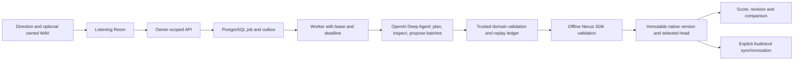

# Pocket Producer: current project walkthrough

Refreshed against `c87ecb5` on 2026-09-27, including the single-workspace retirement and recorded Sol/Audiotool evidence. This explains implementation, not heard quality. Current decisions are [ADR 003](adr/003-single-composition-workspace.md), [ADR 002](adr/002-native-construction-first.md), the [native contract](native-text-to-music.md), and [live status](STATUS.md). Older dated handoffs describe historical stages.

## 1. What the product currently does

Pocket Producer is a local, responsive music construction app called the Listening Room. In its single composition workspace, a user describes a piece in plain language, optionally selects WAV recordings they own, and requests a native musical arrangement. A background worker builds a structured document containing sections, instrument parts, notes, reusable phrases, clips, effects, routing, and automation. The user can inspect the score, request a scoped revision while keeping chosen material unchanged, compare saved versions, and explicitly ask for an editable Audiotool copy.

The native arrangement is **symbolic structure**, not an audio file. Native rendering and playback remain deliberately deferred. The score shows notes, pitches, clip intervals and control values; it does not show a native waveform or loudness. The Midnight Escalator Audiotool copy has matching live v7 structural readback, but that evidence is limited to this score, not every feature or heard sound quality.

The separate **Playable audio** product, four-stem renderer and legacy routes have been removed without a compatibility editor. Optional source upload, recording and audition remain under Sounds. Audition plays the original recording, not the composition. Native history, protections, drafts and accumulated financial records are retained.

## 2. Repository and running processes

This is a TypeScript/pnpm workspace, organized as a modular monolith rather than a fleet of services. The root [package manifest](../package.json) pins pnpm and Node ranges and supplies local run, migration, verification, browser, budget, and optional live verification commands.

| Component | Responsibility | Main implementation |
| --- | --- | --- |
| Web app | Responsive Listening Room, recording and audition, score, progress, version comparison | [apps/web](../apps/web/src/App.tsx), [native room](../apps/web/src/features/native/native-room.tsx) |
| API | Validated commands and owner-scoped reads, uploads, job status, Audiotool session handoff | [Fastify server](../apps/api/src/server.ts) |
| Worker | Claims durable jobs, runs native construction/synchronization, checkpoints external effects, commits results | [worker](../apps/worker/src/worker.ts) |
| Shared core | Canonical schemas, musical operations, producer, provider accounting, storage and Nexus adapters | [packages/core](../packages/core/src/index.ts) |
| PostgreSQL | Projects, immutable versions, jobs, events, provider effects, construction steps, plans and synchronization checkpoints | [migrations](../packages/core/src/db/migrations) |
| Local private storage | Uploaded WAVs below a configured server-owned directory; retired test artifacts may remain inaccessible | [local storage](../packages/core/src/storage/local-storage.ts) |

Development starts three local processes with `pnpm dev`: Vite, the Fastify API, and one worker. [Docker Compose](../docker-compose.yml) supplies PostgreSQL 17.6 on a loopback port. `pnpm db:migrate` applies additive SQL migrations through `017_native_creative_review.sql`; 015–016 provide safe public activity and 017 stores focused creative review. There is no Redis, object-storage service, deployed authentication provider, or public deployment in this milestone. The application deliberately refuses production startup with the temporary loopback development authentication mode.

## 3. The native document: the musical source of truth

The native document schema lives in [model.ts](../packages/core/src/native/model.ts). Its `schemaVersion` is 2, and it measures musical time at 960 ticks per quarter note. It holds a title, original direction, current objective, assumptions, tempo, meter, total bars, contiguous named sections, parts, motifs, protected IDs, selected source IDs, and an explicit audio state of deferred, unavailable, or stale.

Each part has a role, an instrument or audio device, gain and pan, free MIDI notes, placements of reusable motifs, owned or Audiotool library clip regions, serial and optional parallel effects, automation, routing into mixer groups, and sends. Motifs contain notes and can record a family identity and the parent motif from which a variation came. This lets the app distinguish one changed phrase instance from every other use of the original phrase.

The schema limits a piece to 4–128 bars, at most 24 sections and 24 parts, tempo 40–220 BPM, meters with denominators 4 or 8, and bounded counts of notes, placements, clips, effects, curves, and groups. It checks ordered section coverage, unique identities, note placement, supported device parameters, valid routing, and protection dependencies. These limits are implementation bounds, not a musical recommendation.

The native document is saved as an immutable row in `native_revision`; `native_project_head` selects the current row. A successful revision creates a new row and normally selects it automatically. **Use Before** or **Use After** changes only that local selection. An unsuccessful or safely paused job does not replace the accepted head. Historical audio tables remain in migration history but have no active editor, read API or worker path.

## 4. From a user request to a durable job

The web app sends a native construction or revision command to the [API](../apps/api/src/server.ts) with an idempotency key and its expected current native head. The API validates direction length (3–32,768 characters), selected source IDs, profile, revision scope, and ownership. It creates a job and outbox entry in one database transaction. Repeating the same key and request returns the original job; reusing the key with different input conflicts. A different key cannot casually bypass an unresolved prior effect.

The [worker queue](../packages/core/src/db/repository.ts) uses PostgreSQL row locking with `SKIP LOCKED`, database time, lease generations, and an attempt UUID. A worker heartbeat checks cancellation, absolute deadline, lease ownership, and monitoring health. If a worker dies, another can claim an expired lease. The old attempt may still settle observed provider usage, but its lease cannot write progress or commit a version. Queue time counts toward the deadline. Failed, cancelled, expired, and needs-attention states are recorded as ordered job events.

The browser keeps a project-specific submission receipt so a lost HTTP acknowledgement can be resolved against the server without resending the creative command. Polling, drafts, playback and late responses are guarded by active project identity. Leaving a room does not cancel its running job. The UI shows meaningful progress, errors, and safe recovery options rather than treating a long request as one synchronous page load.

The API surface follows that separation. `/api/v1/projects/:id/native` returns the selected native document, immutable versions and synchronization state. Native construction, revision, preservation preview, partial-draft inspection/continuation/extension, local version selection and explicit synchronization each have their own routes. Asset upload and audition routes are shared infrastructure. Older generation, revision, version-audio and stem-export routes have been removed. `/api/v1/jobs/:id` and the command-receipt route expose durable status without granting a model or browser direct database access.

The key database tables also have distinct roles. `project` and `asset` identify an owned room and its sources; `job`, `outbox` and `job_event` describe accepted work and progress; `native_job_plan`, `native_job_step` and `native_producer_completion` distinguish intention, confirmed intermediate edits and checked completion; `native_revision` and `native_project_head` hold saved music and selection; `native_revision_sync` and `native_sample_upload` hold remote reconciliation state. Older audio tables are historical schema, not an active product. Retiring disposable audio-only tests preserves minimal financial identities and effects. The `effect` ledger spans model providers and jobs so a new room cannot reset site spending.

## 5. The current OpenAI Deep Agent

The production producer is [produceNative](../packages/core/src/native/producer.ts), built with `deepagents` on LangGraph and an OpenAI `ChatOpenAI` model. The configured model is read from the server environment; the current configuration default is `gpt-6-sol`. The agent has a PostgreSQL graph checkpointer, a virtual workspace, and three repository-local runtime skills: [native arrangement](../agent-skills/native-arrangement/SKILL.md), [native revision](../agent-skills/native-revision/SKILL.md), and [native sound design](../agent-skills/native-sound-design/SKILL.md). Its filesystem permissions allow reading only scoped workspace/skill paths and deny arbitrary writes. It has no shell, rendering or direct Audiotool mutation tool. A bounded sample-character tool can request separately accounted Gemini analysis of shortlisted audio; it cannot listen to the native score.

The agent's job is more than returning a one-shot blueprint. It first records a typed plan with an intent, section purposes, sound goals, hard constraints, and development tasks. That plan and its stage are saved in `native_job_plan`, independently of chat history. The agent may choose an initial form, then apply small batches of musical operations, inspect the resulting material, refine it, and review at least two current sections after its final change. An optional initial form is a starting point; the fixed 32/64-bar forms used in fixture tests are not the production template.

Long directions are retained exactly. The agent receives a compact current context and can page through the original brief with `read_native_brief`; a 32,001-character end-of-brief path has a maintained regression. After confirmed operations, middleware refreshes the real document hash, plan, sections, parts, protections, and recent step hashes in subsequent model context. It keeps valid tool-call/result pairs and discovery or error evidence. A fresh LangGraph attempt can resume the same logical job after a safe graph pause, using the durable plan and operation ledger rather than assuming the graph's remaining-step count is the financial allowance.

The model can propose changes, but trusted code checks every batch. Its sole general mutation entry is `apply_native_batch`; `compose_native_form` is available only at the start of a new piece. The model cannot issue the `protect` operation through that batch tool. User protection changes take the separate validated request path. A completed plan, agent declaration, or graph completion does not itself create an accepted version.

### The agent's actual tool groups

| Group | Tools and purpose | Authority limit |
| --- | --- | --- |
| Planning | `record_native_plan`, `read_native_plan`, `advance_native_stage`, `read_native_brief` | Stages describe work; they cannot select or synchronize a version. |
| Inspection | `inspect_native_workspace`, `inspect_native_section`, `inspect_native_part`, `inspect_native_motif`, `inspect_owned_source` | Reads bounded, current facts. Owned WAV profiling measures activity, not semantic hearing. |
| Discovery | `discover_native_capabilities`, `inspect_native_capability`, `search_native_resources` | SDK facts and local recipes are information, not permission to write unsupported fields. |
| Connected resources | `search_audiotool_presets`, `inspect_audiotool_preset`, `search_gm_sounds`, `inspect_gm_sound`, `search_audiotool_samples`, `inspect_audiotool_sample` | Server mediated, dependent on a connected account. Search metadata does not prove rights or audibility. |
| Construction | Optional `compose_native_form`; primary `apply_native_batch` | Zod schema, ownership, source hashes, protection, scope, replay, and SDK validation remain authoritative. |

The operation schema includes exact notes, voiced harmony cycles, expressive MIDI hits, motif placement and variation, phrase handoff, section-local note and clip edits, instrument parameters, ordered effects, serial/parallel processing, groups, sidechain, shared sends, master settings and supported automation. Beatbox8 is deliberately limited to boolean steps; expressive velocity belongs on MIDI-capable instruments such as Gakki. Crossing clips and automation are edited only when the application can preserve the outside section exactly; unsupported loop cycles or curve splits fail instead of being approximated.

## 6. The independent completion gate

The [intent interpreter](../packages/core/src/native/intent.ts) conservatively extracts explicit BPM, meter, total or section lengths, section entrances, role requirements and exclusions, preservation/change instructions, chord chains, and requested processing structures. It treats clauses separately: “keep bass” differs from “no bass,” and “bring in chords” is not invented as a section name. When the user says “keep the theme,” the app resolves a unique saved melodic phrase family or asks for a more precise name.

After the agent stops, [nativeCompletionIssues](../packages/core/src/native/producer.ts) checks objective facts against the constructed document: requested bars/sections, BPM/meter, roles and absence, protected material, selected sources, explicit chord pitch classes, and named shared processing or automation. In a revision it also checks that the requested role actually changed. A wrong but schema-valid proposal can be sent back for correction; maintained scripted integration tests demonstrate this with an incorrect bass/drum revision and an incorrect chord pitch.

This gate verifies symbolic obligations, not composition quality. It cannot prove memorable themes, voice leading, tension, mix perception, source rights, or heard sound. Ambiguous creative language is deliberately narrower than unrestricted natural-language understanding. The next real-model benchmark across long, sparse, and vague briefs has not been completed under the expanded producer.

## 7. Construction replay, partial drafts, and recovery

[NativeToolSession](../packages/core/src/native/producer.ts) serializes even simultaneous model mutations. Before saving a step, it checks its key, operation hash, preceding document hash, current worker lease, and validated result hash. On restart it replays saved steps in ordinal order and checks each predecessor/result hash. A duplicate step with different operations conflicts; a corrupted historical step fails closed without rewriting accepted music.

Confirmed steps can appear as **Work in progress** while the job is running or safely paused. They are reconstructed from the step ledger and labeled unselected. `native_producer_completion` records the checked aggregate separately from the plan and steps. The worker then validates the final document in the pinned Nexus SDK and commits an immutable revision only while the owner, project, expected head, lease, deadline, source hash, and cancellation checks still hold.

For a source-bearing document, that local SDK validation checks the structure it can construct before remote upload. The returned offline evidence can still list unresolved owned-source regions because their Audiotool sample identities do not exist yet. The explicit synchronization job must upload them, resolve every region and validate/read back the complete mapped structure before claiming a verified remote copy.

Standard and Extended profiles are captured in each job when accepted, including model/pricing evidence, reasoning effort, input/output/call limits, deadline, and per-job cost ceiling. Nominal Standard targets 40 calls, 64k conservative input-bound units, 16,384 initial output tokens, 30 minutes and US$5. Extended targets 80 calls, 96k input-bound units, 32,768 initial output tokens, 60 minutes and US$15. Current environment limits can make either smaller; the current configured per-job ceiling is US$5 and the separate installation-wide ceiling is also US$5. Later construction calls use smaller output reservations. These are technical ceilings, **not authorization to spend them**.

When a known call, graph, input, output, or financial limit pauses confirmed work, the room shows the plan, draft, used and held cost, unknown cost, model calls, and the safe reason. A user can explicitly increase the same request's limits within configured maxima and then continue it. Extension does not raise the installation-wide cap, clear unknown liabilities, change the original operation identity, or rescue a job whose selected head changed. Uncertain provider outcomes require reconciliation, not automatic retry.

## 8. Sources, library content, and truth about use

An owned WAV is uploaded through the API, decoded/validated, hashed, saved in private local storage, and attached to its owner and project. The browser can record WAV, upload it, and audition it. Source selection is explicit for a native request. The worker rechecks the selected asset's ownership and byte hash and measures duration, peak, RMS, and coarse activity windows. These facts help choose an interval; they are not musical listening. A selected source may be placed as a native clip, but placement does not prove an audible result or an independent license.

Connected Audiotool resources are separate from owned WAVs. The server can search samples, presets, and the pinned General MIDI catalog when a usable session exists. Before using a preset, it records and rechecks a fingerprint of its SDK configuration; if that configuration changes, the application requires a deliberate new selection. Historical unpinned preset references remain readable but cannot be trusted for synchronization. Library sample identity, owner, display name, and duration are rechecked, while the remote sample bytes themselves are not immutably pinned. Metadata visibility does not establish usage rights.

## 9. The Listening Room interface

**New session** opens Start; acceptance moves to the durable arrangement/Producer workspace. Sounds and Versions are direct tools; Manage parts belongs beside the score. Usage and Audiotool connection are under Session options, with a state-aware Copy/Open Audiotool action in the header. Public activity is persisted transactionally and delivered through owner-scoped SSE with bounded cursor-polling fallback—not raw model thoughts or LangSmith traces. Failed score/draft reads have bounded reconciliation and **Refresh arrangement**, without resending creative commands. **Leave this draft** explicitly abandons a safe paused request while keeping music, draft history and costs; uncertain external effects remain blocked.

The web app uses React/Vite, Tailwind, locally owned shadcn-style components built on Base UI primitives, Lucide icons, Motion for React, and the established ivory, forest-green, and burnt-orange design. [App.tsx](../apps/web/src/App.tsx) owns project navigation, project-safe source refresh and Audiotool connection. [NativeRoom](../apps/web/src/features/native/native-room.tsx) owns the native form, scope, protections, durable job display, partial recovery, version history, and synchronization controls.

The current arrangement is central. [score.ts](../apps/web/src/features/native/score.ts) projects canonical notes, motif repetitions, phrase lineage, and clip intervals into lanes. The overview height means **note starts per bar**, not volume. Selecting a section opens exact symbolic details; selecting a part opens a responsive inspector with notes, pitch, clip intervals, routing and controls. Inspection does not silently set a revision target. Explicit **Change this section**, **Change this part**, or **Change whole piece** sets the scope above the direction form. **Keep unchanged** marks protected parts. A server preservation preview checks names and the expected head before submission; the worker enforces the actual protection again.

The UI bounds large arrangements: the overview shows at most 120 phrase/clip blocks per lane, focused detail shows eight bars at a time, and part lanes are progressively disclosed. Family names and original/variation relationships accompany color. The score's confirmed-change animations use saved before/after facts, ignore stale or duplicate receipts, and show the same final information under reduced motion. It does not invent a chronological note-by-note construction sequence or an audio reaction.

After a successful revision, **Before / After / Changes** opens automatically. The comparison keeps time, pitch scale, and part order paired. It detects changed note pitch/timing even when note counts match, materialized motif changes, clip content/phase, supported section-local control curves, and shared processing dependencies. It labels unsupported alignment or easing **unverified**. Browsing comparison is read-only; only **Use Before** or **Use After** selects a saved version. Local restore does not update an Audiotool copy.

The native UI deliberately has no composition play button. [SourcesPanel](../apps/web/src/features/sources/sources-panel.tsx) owns optional upload/recording/selection. [SourcePlayer](../apps/web/src/features/sources/source-player.tsx) coordinates a single source-only `HTMLAudioElement`, with labeled seek and volume. Closing the sheet or changing projects stops playback; late microphone permission is cleaned up. Wavesurfer was removed with the old waveform view.

## 10. Nexus and Audiotool

The native mapper in [adapter.ts](../packages/core/src/native/adapter.ts) is currently `nexus-native-v7` against pinned `@audiotool/nexus@0.0.17`. It converts canonical 960 ticks per beat to the SDK's 3840, sets tempo/meter/duration, creates supported instruments and tracks, notes and patterns, owned/library source regions, effects, group and parallel routing, sends, and automation. The application validates a local SDK document and performs semantic readback; it does not treat a count of entities as sufficient. The mapper owns only documents it creates and refuses to overwrite an occupied target automatically.

Native synchronization is an **explicit separate job** for one immutable version. It preflights resources, persists project creation before calling the provider, records the returned project identity, uploads selected owned WAVs with source-hash identities and waits for upload/readiness, writes the mapped structure into an empty project, and opens the project again for fresh semantic readback. Only a matching hash under the **current mapper version** can label that revision verified and expose its Studio link. Interrupted create/upload/write responses become uncertain or conflict states; they are not blindly replayed. A recheck of a verified project reads without overwriting edits made in Studio.

OAuth/PKCE consent and encrypted owner-bound token persistence have worked. Reconnect if consent expires. The September 27 Midnight Escalator copy matched fresh authenticated readback twice after fixing pointer-order-dependent hashing; read-only reconciliation marked the same project verified without repeating the write. Source-bearing synchronization and the full device/routing range still have offline or contract-double evidence only. Previous render probes did not retrieve playable native audio; rendering remains deferred.

## 11. Source analysis and the future listening boundary

The separate [Gemini adapter](../packages/core/src/providers/gemini.ts) distinguishes model observations from measured duration, peak, RMS and non-silent ratio. The native sample workflow can inspect shortlisted audio and optionally request bounded character analysis through the shared effect ledger. This is not a whole-piece listening or render–repair pipeline. The removed Sunroom renderer is not a fallback for native music.

Successful live Gemini analysis has not been verified in the retained evidence. Historical post-dispatch failures retain unknown liability and are not silently retried. Native rendering/playback and Gemini listening remain deferred.

## 12. Provider spending, credentials, and security boundary

[Config](../packages/core/src/config.ts) loads the ignored root `.env` on the server and validates model, job, upload, provider, and environment settings. The frontend receives availability/status information, not provider keys. Audiotool tokens are encrypted at rest with AES-256-GCM using an ignored local key, bound to the owner. The current identity model is one explicit loopback development owner; the API refuses to start as a production service with that mode. A real public authentication/deployment architecture remains future work.

[Provider effects](../packages/core/src/providers/effects.ts) are recorded before dispatch with stable input identity and `reserved → dispatched → succeeded/failed/uncertain` states. PostgreSQL advisory locking enforces a shared installation budget across OpenAI and Gemini. Reservations are in integer microdollars. Observed usage is charged once; an ambiguous post-dispatch result keeps a reservation and is not described as free. The OpenAI callback bounds the actual serialized model messages conservatively before dispatch, uses captured pricing evidence, disables SDK retries, and uses provider-reported cached input only when present.

The September 27 recorded ledger has **US$5.330298 spent/reserved under the explicitly authorized US$8 installation cap**, including unknown liabilities. The remaining US$2.669702 is an upper bound, not new spending permission. Retiring obsolete tests did not reset costs. This documentation verification makes no provider call.

## 13. Tests and what they prove

Ordinary tests use fixture/scripted models, an isolated `_test` PostgreSQL database, separate assets and disabled tracing/provider access. [CI](../.github/workflows/ci.yml) runs lint, types, unit, integration, build and Chromium browser/visual checks. The latest product results in [testing.md](testing.md) are **141 unit tests, 68 integration tests, 14 browser journeys and 8 visual journeys**, plus lint/types/build. This documentation pass runs the course's own static and browser checks; it does not repeat the entire application evaluation.

The integration suite covers the actual worker and PostgreSQL lifecycle: replay after restart, contending workers, stale lease fencing, duplicate requests, cancellation, partial extension/continuation, protected revisions, source ownership, provider-effect accounting, and offline Nexus behavior. Scripted Deep Agent turns traverse the production tool wiring and demonstrate objective correction; they do not measure a live model's creativity. The browser journeys cover create/revise/compare/restore, source audition, retired-route rejection, mobile viewport, focus return, reduced motion, stale responses, and larger documents. The visual suite samples actual note geometry during confirmed animations and checks contrast and emulated keyboard space. Screenshots and traces in ignored `.local/evidence` are fixture evidence, not heard audio or live-provider proof.

## 14. What is established and what is still open

| Area | Established locally or historically | Still open |
| --- | --- | --- |
| Native construction | Schema, validated operations, durable plan/steps, scoped revision, immutable versions, score and structural comparison; extensive scripted/fixture tests | Real-model artistic assessment of the expanded 96-bar and contrasting briefs; heard native output |
| Owned sources | WAV upload, owner/hash validation, measurement, local placement and offline mapping | Live owned-WAV upload/readback in the expanded Audiotool sync; independent rights verification |
| Audiotool | OAuth/session, offline v7 mapping/recovery, matching live Midnight Escalator structural readback | Full mapping-range and source-bearing live sync; usable native render result |
| Gemini | Typed adapter, bounded sample analysis, shared accounting and unavailable states | Successful live analysis; uncertain historical liabilities; native listening deferred |
| Interface | Tested desktop and emulated phone/tablet Chromium flows, keyboard/focus, reduced motion and bounded large score | Physical phone/OS keyboard/safe areas, screen-reader study, Firefox and WebKit |
| Deployment | Local loopback application, Docker PostgreSQL, CI and private local assets | Production identity, public hosting and operational storage; deployment/submission are outside this milestone |

Version labels describe separate contracts: the current native mapper is `nexus-native-v7`, migrations run through 017, and the canonical document is schema v2. The API capability label `audio-independent-validated-native-v1` is not the document schema version. Older dated sections elsewhere describe their historical implementation.

## 15. How to explore it locally

With Docker available, the [native guide](native-production-guide.md) gives the normal path: `pnpm install --frozen-lockfile`, `pnpm db:up`, `pnpm db:migrate`, then `pnpm dev`; open `http://127.0.0.1:5173`. Create a session, give a text direction, inspect the saved score, explicitly scope a change and keep a part, compare Before/After/Changes, and choose a saved version if desired. An owned WAV is optional. This local run can use the configured OpenAI key and therefore incur provider cost; fixture/browser tests are the provider-free demonstration path. Do not choose **Copy to Audiotool** merely to inspect the score: it is an explicit remote Audiotool mutation when connected and authorized.
