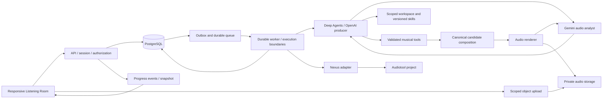

# Architecture and decision boundaries

## Recommended baseline

Use a **TypeScript modular monolith**, one repository, and three runtime roles: browser UI, HTTP API, and asynchronous worker. Share domain contracts; isolate provider adapters. Keep PostgreSQL as durable application storage and queue backing, with private object storage for audio. This gives the solo builder a tractable system whose long-running work survives a closed phone.

| Concern | Default | Why / room to improve |
| --- | --- | --- |
| UI | React + Vite + TypeScript | Responsive app without server-rendering requirements; choose compatible current versions |
| UI components and styling | shadcn/ui + Base UI + Tailwind CSS + Lucide | Own themed component source; use established interaction primitives while preserving Listening Room. See [component-system plan](15-UI-library-and-component-system.md) |
| HTTP | Fastify with validated JSON contracts | Small explicit API; generate OpenAPI from the same contract source |
| Durable data | PostgreSQL + migrations | Transactions, ownership, immutable revisions, job/outbox state |
| Queue | pg-boss or equivalent Postgres-backed queue | Avoid a second persistence service; application side effects still need deduplication |
| Music agent | Deep Agents on LangGraph JS, persistent checkpointer | Main creative harness: workspace, skills, context management, bounded specialist delegation; application code owns invariants |
| Producer model | OpenAI through a verified Responses-capable LangChain integration | Existing key is user-reported in destination env; GPT-6 Astra is the initial model candidate, subject to actual access and bounded testing |
| Audio analyst | Gemini through a separate typed adapter | Analyze real source/preview audio; return scoped observations, never override measured checks or musical locks |
| Audio | Worker renderer + FFmpeg adapter | Controlled server-side preview path if official rendering is unavailable |
| Assets | S3-compatible private object storage | Large immutable audio objects separate from relational state |
| Auth | Verified Audiotool identity plus app session | One initial user identity; do not trust a client-supplied account ID |
| Tests | Vitest, real-Postgres integration tests, Playwright | Domain invariants, recovery, browser journeys |

These are proposals, not an installed stack. Pin a mutually compatible Node LTS, package manager, SDK, FFmpeg build, and dependencies after Phase 0. An existing well-supported equivalent stack can be retained if it lowers implementation risk. Do not add both Python and TypeScript agent services solely for familiarity; document a concrete capability that justifies the extra runtime first.

## System flow



API accepts intent and persists a job; it does not perform a full audio render inside an HTTP request. The browser observes actual progress and plays a completed artifact. The worker never depends on a live browser tab to complete an accepted job.

## Suggested repository boundaries

```text
apps/web/                 routes, screens, player, responsive components
apps/api/                 HTTP, app sessions, access checks, event delivery
apps/worker/              job runner, orchestration, leases, checkpoints
packages/contracts/      canonical schemas, wire types, error codes
packages/domain/         pure composition, revision, source-use rules
packages/music/          palettes, arrangement primitives, musical constraints
packages/audio/          decoding, rendering, analysis, QA adapters
packages/nexus/          SDK/auth/project mapping; no UI dependencies
packages/agent/          Deep Agents producer, workspace policy, skill loading
packages/providers/      OpenAI, Gemini audio analysis and transcription adapters
packages/db/             schema, migrations, repositories, transactional outbox
packages/config/         validated server/client configuration
tests/fixtures/          tiny owned audio, example plans, licenses
tests/integration/       real infrastructure and fault injection
tests/e2e/               browser product journeys
docs/                    setup, architecture, ADRs, status, runbooks, evidence
```

Create packages when their boundary is used; do not scaffold dozens of empty workspaces. A small initial `packages/core` can split later. The important rule is dependency direction: domain logic must not import React, a model SDK, or Audiotool-specific entity types.

## The composition is the authority

Own a versioned **composition intermediate representation (IR)**: tempo, time signature, source references, tracks, clips/notes, section structure, render settings, and lineage. The same accepted IR feeds preview rendering and Nexus export. The agent proposes validated edits to the IR; it does not issue arbitrary production SDK mutations.

Store musical time as integer ticks with an explicit project PPQ, proposed 960. Convert to the SDK's timing through its actual exported constants; do not assume our tick is an Audiotool tick. Convert to sample offsets only at rendering. Store audio sample rate separately. Tempo changes within a composition are outside the first version, avoiding ambiguous conversion and time stretching.

Preserve render reproducibility with asset hashes, algorithm/renderer versions, processing parameters, seed, and normalized composition hash. Floating-point PCM may vary across unpinned platforms; require byte equality only for cached preserved objects and the fixed reference environment, not across all codecs/hardware.

## Transaction and queue pattern

Within one database transaction: verify owner and expected head revision; insert job and initial event; insert an outbox record. An outbox dispatcher publishes work with stable job ID, then marks the outbox entry delivered. A crash between publish and marking may publish twice; the worker must safely deduplicate. Never rely on queue marketing language to make remote uploads or paid model calls exactly-once.

Workers claim a job with a lease and fencing generation. Before durable writes and final commit, verify that lease/generation is still current. Heartbeat long work. Use step-specific idempotency keys and an effects ledger for model requests, generated artifacts, and external exports. If a remote effect may have succeeded before a timeout, reconcile its known identifier or stop in `needs_attention`; do not blindly duplicate a project or charge.

Cache safe completed steps by input hash and implementation version. Do not reuse a render across different source processing, tempo, or effects. Retry transient failures with capped exponential backoff and jitter, with a finite attempt budget. Permanent input errors require a correction; they do not repeatedly consume paid calls.

## Immutable revisions and concurrent use

Each generation/revision job has an immutable `baseRevisionId` and `expectedHeadRevisionId`. A successful candidate is stored as a new revision. Advancing the project head uses compare-and-swap. If another device changed the head, keep the candidate as a branch for explicit selection; never overwrite the newer choice. Only one mutating generation per project should run by default, but this check still matters after a restore or retry.

Player selection and the project's accepted head are different state. Auditioning an older version should not silently restore it. Source deletion must be blocked or carefully detached while a retained revision still references it. A project deletion revokes access promptly and schedules owned-object cleanup after in-flight jobs are fenced off.

## Authentication and authorization

Use Audiotool's supported browser authorization flow and server-token handoff when confirmed against the installed SDK. On handoff the server verifies the token with an authoritative identity endpoint; a JSON `userId` sent by the browser is not proof of identity. Bind the exchange to the initiating browser session with CSRF/origin checks and rotate the app session after login. Use exact allowlisted redirect URIs, never arbitrary post-login redirect URLs.

The browser receives an opaque secure HttpOnly app-session cookie. Store refresh credentials encrypted server-side with a key from server-only configuration; serialize token refresh per identity and persist rotated tokens atomically. Verify the SDK's own browser-storage behavior and document it. Do not put provider/API keys, refresh tokens, or personal access tokens in `VITE_*`, localStorage under application control, source control, or logs.

Every project, revision, asset, job, export, and event query enforces ownership server-side, including signed-download issuance. UUID opacity is not authorization. Protect mutation routes against CSRF; use same-origin production routes where practical. An optional fixture demo uses isolated read-only data and no private credentials.

For local initial development while Audiotool authorization is pending, an explicit **development-only local session** may own real private local projects and use the real OpenAI adapter. This is separate from mocked model/audio fixtures. Require development environment plus an explicit flag, bind to loopback, and refuse production startup with that flag. Keep the same owner-scoped domain checks. Production login and live Nexus evidence remain pending until real authorization is verified.

## Storage and artifact lifecycle

Upload flow: create scoped upload intent → upload temporary object → server probes content/size/duration → asset becomes ready or rejected → promote to immutable storage key. A browser's reported MIME/size is only a hint. Do not make unvalidated uploads accessible to other users. Serve playable outputs with byte-range support and correct content headers; support signed URL refresh after expiry without resetting the session.

Initial configurable limits: 100 MB per source file, five minutes decoded duration, twelve sources per session, four primary musical parts, sixty seconds musical body. These are proposed bounds to measure, not permanent product laws. Add decoded-sample/memory limits to protect against compressed bombs and pathological channels/sample rates. Include deliberate reverb tails in declared render length.

Store original assets, derived assets, preview/stem artifacts, and export mappings distinctly. Retention defaults should be visible: keep user session material until deletion in the initial release; clear abandoned temporary uploads after 24 hours and failed-job scratch files after a short configured interval. Derive shared-object deletion from references, not filename guesses.

## Operational simplicity

Use structured logs and stable request/job IDs, bounded concurrency, measured per-job budgets, and a staging environment. No Kubernetes, event-sourcing platform, plugin marketplace, or distributed microservice fleet is justified initially. The explicit state machine and transactional domain are the robustness investment; service count is not a proxy for quality.

Record ADRs for audio path, canonical IR/export fidelity, auth/token storage, persistent execution, and production hosting. Each must include observed evidence, alternatives, consequences, and conditions that would justify revisiting it.
