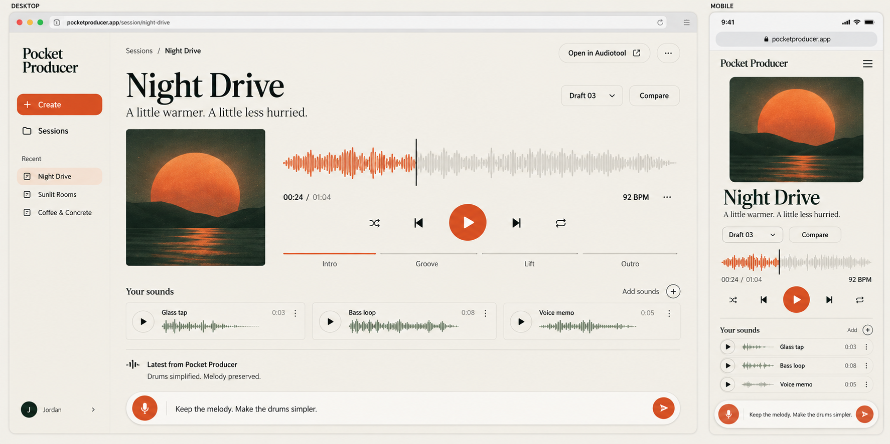

# Listening Room — UI and interaction specification

**User-selected design direction, 20 September 2026.** This choice supersedes the assistant's earlier preference for another design. Preserve its calm, editorial, music-first character while improving usability through implementation and testing.

The image is visual direction, not a raster to place behind invisible controls. Build semantic, responsive components. Its fictional session, timing, waveform, artwork and user details are illustrative; drive the real interface from actual state. Do not replicate browser chrome, a fictional profile, or nonfunctional controls.

## Component foundation

Use **shadcn/ui with Base UI primitives, Tailwind CSS and Lucide** as the implementation default. The [UI library and component-system plan](15-UI-library-and-component-system.md) defines alternatives, token mapping, component responsibilities, setup and interaction tests. Reuse the difficult interaction foundations and customize the owned source to this design. The library's default appearance is not a new visual requirement. Waveform, transport coordination, source workflow and musical version behavior remain product-specific compositions.

## Design principles

1. **Listening comes first.** The current piece, version and transport dominate. A person can listen without reading a chat history.
2. **Direction stays close.** A compact persistent composer invites “What should change?” Text and voice have equivalent outcomes.
3. **Complexity is available when useful.** Sources, sections, protected parts and versions are one action away. No required miniature timeline editor.
4. **The accepted draft stays safe.** Generation is a candidate beside a stable previous result. Changes and restore are explicit.
5. **Progress is factual.** Show real work stages and recovery choices, not made-up percentages, raw chain-of-thought, or tool traces.
6. **Desktop earns its space; mobile completes the same job.** Desktop can reveal context beside the player. Phone layouts prioritize one task at a time.

## Visual language and tokens

Use warm ivory canvas, near-white surfaces, dark green/ink text, quiet gray-green secondary text, fine borders, and burnt orange for the main action. Bright orange can decorate artwork, but do not assume it supports white small text. Proposed values and tested contrast pairs are in [tokens.json](design/tokens.json); adjust if visual QA and contrast testing warrant it.

Typography: editorial serif for session names/major titles, neutral sans for body and controls, tabular numerals for playback time. Start with Georgia and system UI for a dependency-free first pass; a properly licensed self-hosted serif/sans pair can refine the result. Include actual font licenses. Avoid downloading an arbitrary proprietary font or adding multiple heavy families.

Desktop session titles should scale roughly 48–72 px, mobile 34–44 px; body 16 px, supportive labels 13–14 px. Avoid tiny widely spaced uppercase for essential copy. Base spacing on 4/8 px, with 24–40 px between groups. Use subtle 1 px borders, restrained 12–20 px corner radii and almost no elevation. Reserve shadow for menus/sheets; this is not a dashboard full of floating cards.

Cover artwork: one cohesive original abstract image or deterministic palette-based artwork. It gives the session an identity without requiring a paid image-generation job. It must never delay playback. Art can evolve later; no waveform should be decorative fiction when labeled as the actual audio.

## Information architecture

| Route / area | Purpose | Essential controls |
| --- | --- | --- |
| `/` | Public introduction or redirect for signed-in user | Try an example, connect account, concise product explanation |
| `/sessions` | Personal library | New session, recent sessions, search when actually needed |
| `/sessions/new` | Add material and intent | Upload, record a sound, source audition, brief, create |
| `/sessions/:id` | Listening Room | Player, section summary, sources, versions, direction composer, export |
| Connection/settings sheet | Account and operational preferences | Audiotool status, reconnect, sign out, user-visible limits |

Do not require a marketing landing page to finish the app. A concise entry screen is enough initially. Avoid route explosions: versions, source details and arrangement detail can be accessible panels/sheets with meaningful URL state where useful.

## Desktop layout

At approximately 1024 px and wider, use a 192–224 px left session rail and a central content area with a comfortable maximum width around 1200 px. The rail contains the wordmark, obvious New session action, recent sessions, and account menu. Truncate long names with accessible full labels, not horizontal scrolling.

Top row: breadcrumb/session location left; export status/action right. Main header: session title, short user-facing description, version label, and unobtrusive metadata such as 92 BPM and key only when known. Rename via a deliberate small affordance; title text should not unexpectedly become an input when selecting it.

Listening area: square cover approximately 260–340 px wide beside the player. Player contains current time/duration, actual waveform, play/pause, seek, volume, repeat-section or repeat-piece as supported. The mockup's extra transport icons may be simplified. Do not include shuffle/skip controls unless there is a real queue with a clear meaning.

Below: a section strip (Intro / Groove / Lift / Outro, or actual names), then the sources strip and a concise latest-change summary. Sources use small real waveform previews and name/role badges; the selected source opens a detail drawer. A compact “Parts” disclosure reveals drums/bass/melody/texture, audition and protect controls. No full track lanes in the default view.

Composer anchored near the bottom of the content region, not across the entire window under the sidebar. It has a multiline text field, dictation button, send/cancel state, and context chips such as `Groove selected` and `Melody protected`. Display a small estimated scope only when useful. Keep content padding sufficient that the composer never hides the last source or version action.

## Mobile and intermediate layout

Below roughly 640 px, collapse the rail into a session menu. Use a compact header, title, artwork at a controlled size, player, section selector, sources and concise status. The composer sits in a safe-area-aware lower dock; use dynamic viewport units and account for the on-screen keyboard. When the keyboard is open, keep the input and submit button visible without trapping all other content offscreen.

At 640–1023 px, use a reduced rail or menu and a flexible player/art arrangement based on actual fit. Breakpoints are implementation starting points, not mandates to leave awkward gaps at tablets. Test at 360, 390, 768, 1024 and 1440 px widths, landscape, and 200% zoom.

Version comparison, source trimming and part protection open as accessible bottom sheets on phones and panels/dialogs on desktop. Essential operations must not require hover, dragging, or a tiny timeline target. Provide buttons and numeric controls for any drag interaction. Keep typical targets at least 44 px and spaced for touch.

## Creation and source flow

Empty session copy should invite action: “Start with a sound or an idea.” Offer Add sound, Record a sound, and Try an example. Show one or two grounded examples, not an endless prompt carousel. If creating without a source, the selected palette supplies explicit owned/licensed material.

Upload items progress through uploading, inspecting, ready or failed. The user can continue writing while inspection runs. A source detail panel shows waveform, audition, trim handles plus accessible time fields, role and source-use setting. Preserve the original; trimming creates a derived reference. A failed source can be retried or removed without resetting the whole session.

**Distinguish microphones:** “Record a sound” captures a musical asset; “Dictate direction” transcribes speech into the composer. Use labeled entry points, visible recording duration/status, and explicit stop/discard/use actions. Ask browser permission on user action, never on page load. Rejected permission yields an upload/text alternative. Validate MediaRecorder formats at runtime and decode the actual recording server-side.

User can correct a dictated instruction before sending. If a transcription provider is unavailable, keep recorded source capture and typed commands functional and explain that dictation is currently unavailable. Never upload a voice memo to a third-party transcription endpoint merely because it exists in the source library.

## Playback behavior

One app-owned audio engine/player coordinates piece, source and A/B audition; starting a source pauses the mix to prevent confusing overlap. Returning from a source should offer/resume the prior position only through understandable user action. Keep audio state outside components that frequently remount.

Use explicit user gesture to start audio. Show buffering and actual error state. Support seeking and byte-range delivery. Refresh an expired media URL while preserving the desired time. Handle switching sessions, navigating away, headphone removal/interruptions where observable, and ended events. Mobile browser background playback is platform-dependent; don't promise uninterrupted playback everywhere.

The waveform is also a seek surface, but expose a labeled accessible slider and current/total time in the DOM. Keyboard arrows seek when the player/slider has focus. Space toggles playback only when focus is appropriate, not while typing. Provide visible focus, meaningful button labels, and reduced-motion behavior.

## Revisions, protection and A/B

Example: user chooses Groove and protects Melody, then writes “simpler drums, a little more space.” Composer scope chips make that explicit. Submission includes base version, target sections and protected part IDs. The server validates these; visual chips alone do not enforce preservation.

While rendering, keep the current mix playable. Show “Reworking the drums…” only if that stage is actually underway. Cancel marks a request and explains that already completed external work cannot always be undone. On success, show “Version 3 ready” and a short diff-derived summary, with Listen and Compare. Auto-selecting a candidate for visual display must not start sound or silently discard the prior head.

A/B panel identifies each version, actual changes and protected parts. Keep playback position when switching equal-length arrangements; otherwise clamp to available time and indicate the mismatch. Avoid clicks with a brief measured crossfade if implemented. Match preview playback gain consistently so louder does not automatically seem better; do not alter archived artifact masters to accomplish UI comparison.

“Use this version” changes the accepted project head transactionally. “Compare” only auditions. “Restore” creates an explicit head change with history, not deletion of later revisions. Show conflict messaging if a second device has selected a new current version.

Protection default: preserve a track's note/event content, source references, timing, transforms and its isolated rendered artifact. Global tempo/key changes that would violate the lock require a clear choice. Do not promise an unchanged full-mix sound when a changed drum track affects a shared master limiter. See pipeline specification for exact enforcement.

## Required state inventory

| State | What is visible | Recovery / next action |
| --- | --- | --- |
| Empty | Invitation, sound/idea inputs | Add, record, try owned example |
| Uploading/inspection | Per-file progress and cancel; composer usable | Retry individual item |
| Initial generation | Clear current stage; sources preserved | Cancel, return later |
| Ready | Real playable artifact and actual version | Direct, compare, export |
| Revision pending | Previous audio plus revision status | Keep listening, cancel |
| Recoverable failure | Specific plain-language problem, retained input | Retry the failed step where safe |
| Needs clarification | One concrete conflict or ambiguity | Choose constraint tradeoff |
| Offline | Last known state identified; unsent text retained | Reconnect, refresh snapshot |
| Expired connection | Current local session still readable | Reconnect Audiotool before export |
| Exporting | Exact revision and stage | Continue listening; return later |
| Export failed | Preview intact; reason and retry | Reconnect or retry export |
| Deleted/unavailable | Honest absence and navigation | Return to sessions |

Do not show an empty polished ready screen while audio is missing. Do not hide failure behind a perpetual shimmer. Use honest indeterminate status unless a denominator is known, such as bytes uploaded or completed rendering chunks.

## Component/state map

`AppShell`, `SessionRail`, `SessionHeader`, `CoverArt`, `AudioPlayer`, `WaveformSeek`, `SectionStrip`, `SourceStrip`, `SourceDetail`, `PartsPanel`, `VersionPicker`, `ComparePanel`, `DirectionComposer`, `JobStatus`, `ExportAction`, `ConnectionSheet`, and shared accessible dialog/button/input primitives.

Server cache owns sessions/assets/jobs/revisions. Local UI state owns drafts, sheets and playback selection. Persist unsent text per session locally with a small explicit lifecycle; never persist secret tokens or arbitrary private audio in browser storage by accident. Restoring a draft must not automatically resubmit a paid job. Use an event stream plus snapshot refetch for job updates; reconnecting must not duplicate commands.

## Visual acceptance

Compare real screenshots against the selected reference at desktop and phone widths. Check title hierarchy, generous spacing, warm palette, dominant listening area, restrained source controls, and composer reachability. Inspect empty, creating, ready, failed, source panel, and compare states, not just the attractive ready screen. Test long session names, twelve sources, long error text and no artwork. Improvements are welcome; replacing this with a dark studio dashboard is not.
